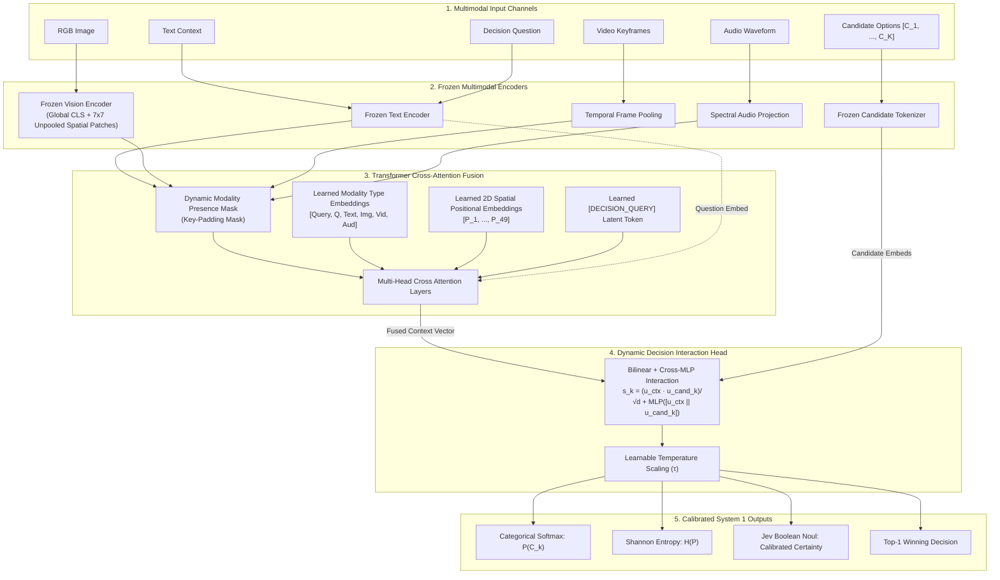

<div align="center">

# ArbiterOmni
### Open-Source Multimodal System 1 Decision Engine
> **State in, calibrated probabilistic decisions out.** Single forward-pass arbitration across video, audio, images, and text with dynamic candidate scoring and zero-leakage missing modality handling.

[](https://python.org)
[](https://pytorch.org)
[](https://astral.sh/uv)
[](https://github.com/mlfoundations/open_clip)
[](tests/)
[](https://huggingface.co/cameronduff/ArbiterOmni)
[](https://typesafe.ai/blog/introducing-system-one-models-and-jev)
[](LICENSE)

[Architecture](#architecture) • [Quickstart](#quickstart) • [Mathematical-Grounding](#how-arbiteromni-works-mathematical-intuition) • [Jev-Primitives](#jev-system-1-primitives) • [Benchmarks](#benchmarks--empirical-evaluation) • [Extensibility](#extending-encoders--fusion)

</div>

---

## What is ArbiterOmni?

Traditional Vision-Language Models (VLMs) operate as **System 2 conversationalists**: they generate answers token-by-token autoregressively. While flexible, this design incurs severe liabilities when deployed in video understanding, media classification, streaming content triage, and autonomous robotics:
- **High Latency & Compute**: Decoding 100 tokens takes 800–3,000 ms.
- **Syntactic Drift & Hallucination**: Output parsing requires complex JSON regex or constrained grammars.
- **Uncalibrated Confidence**: Logprobs over generated prose do not reflect true posterior task certainty.

**ArbiterOmni** is an open-source, proof-of-concept **System 1 Multimodal Decision Engine** inspired by the architecture of **Jev** (TypeSafe AI). Developed as an exploratory side project to test non-autoregressive multimodal decision-making—and trained entirely on desktop consumer hardware—it accepts multimodal context (continuous spatio-temporal video, audio waveforms, image patches, and text premises) alongside an arbitrary runtime list of candidate choices, evaluates the full sensory state in a **single non-autoregressive forward pass** (10–40 ms), and returns a **calibrated softmax probability distribution directly over the candidates**.

```
                              AUTOREGRESSIVE VLM
Sensory State ──> [ 7B-70B LLM Backbone ] ──> Token ... Token ... Token ──> Regex / JSON Parse (800-3000ms)
                                                                             Drift / Hallucination

                                 ARBITER-OMNI
Sensory State ──> [ Frozen Encoders ] ──> [ Attention Fusion ] ──> Calibrated P(Candidate) (10-40ms)
                                                                    Deterministic / Typed
```

---

## Core Highlights

- **Quad-Modal Perception**: Accepts raw text, PIL/tensor images, video keyframe sequences, and audio waveforms.
- **Graceful Missing-Modality Handling**: Modalities can be dropped dynamically. Attention key-padding masks and learned modality-type embeddings eliminate zero-vector skew and phantom activations.
- **Dynamic Candidate Scoring**: Candidate options are **never** hardcoded into fixed classifier classes. Any arbitrary set of $K \ge 2$ text options can be evaluated on-the-fly at inference time.
- **Frozen Encoders + Lightweight Fusion**: Multimodal encoders (OpenCLIP, spectral transformers) remain frozen. Only a lightweight cross-attention fusion network and decision scoring head (~590k parameters) are trained, converging in minutes even on modest CPUs.
- **Jev-Compatible Decision Primitives**: Native support for **Choice** (categorical softmax), **Boolean / Noul** (calibrated binary certainty), and **Score** (continuous ordinal regression).
- **Hardware Agnostic**: Runs seamlessly on CPU, Apple Silicon, NVIDIA GPUs (CUDA), and AMD GPUs (ROCm / Radeon RX 480). Memory footprint remains $<1$ GB.

---

## Architecture

ArbiterOmni decouples sensory feature extraction from decision arbitration:



---

## How ArbiterOmni Works (Mathematical Intuition)

ArbiterOmni replaces multi-second autoregressive text generation with a single deterministic forward pass (0.5–15 ms). At a high level, the decision pipeline follows four intuitive steps:

```
[Sensory Inputs] ──> [Hardware Masking] ──> [Query Fusion] ──> [Dynamic Match] ──> [Calibrated Probs]
 Text, Image,         Turn off missing        Condense scene    Score candidates    Softmax & 95%
 Video, Audio         channels cleanly        into 1 vector     compatibility       Certainty Sets
```

---

### 1. Universal Sensory Tokenization & Zero-Leakage Masking

Each present sensory channel is converted into feature embeddings using frozen foundation models (OpenCLIP ViT for vision, CLAP for audio, SigLIP text transformer for questions):

* **Handling Missing Channels**: If an input is not provided (for example, audio is supplied but no image or video is present), ArbiterOmni marks that channel in a hardware boolean attention mask:
  * `mask[channel] = True` (missing channel: ignored completely by attention)
  * `mask[channel] = False` (present channel: attended to normally)
* **Zero Leakage**: Because attention scores for missing channels are masked out before softmax, absent modalities produce **zero leakage**, zero gradient artifacts, and no NaN errors. The engine operates seamlessly on any combination of 1, 2, 3, or all 4 modalities.
* **Spatial Grounding Patches**: For high-resolution visual inputs, unpooled spatial patch tokens (up to 980 patches) receive 2D positional embeddings, allowing the decision query to localize specific image regions (e.g. left vs right path obstructions).

---

### 2. Scene Condensation via Decision Query Attention

Instead of generating hundreds of tokens autoregressively, ArbiterOmni introduces a single learned vector token: `[DECISION_QUERY]`.

1. The query token attends to all active sensory tokens across the transformer fusion layers.
2. The attention mechanism dynamically weights which sensory clues are most relevant to the question:
   ```
   Attention_Weight = Softmax( (Query · Key) / sqrt(d) + Mask )
   ```
3. The output at the query position compiles the entire multimodal scene into a single unified context vector: `u_context` (768 dimensions in v6-Max).

---

### 3. Dynamic Candidate Scoring (No Fixed Classes)

Traditional classifiers fix their output classes at training time (e.g. 1,000 ImageNet categories). In real-world autonomy and triage, candidate options change continuously.

ArbiterOmni projects any list of dynamic candidate text strings into the same semantic space: `u_candidate`.

For each candidate option, the compatibility score combines three complementary components:

```
Score = Linear_Alignment + NonLinear_Interaction + Visual_Shortcut
```

* **Linear Alignment**: Measures cosine alignment between the fused multimodal state and the candidate option:
  $$\text{Linear Alignment} = \frac{\mathbf{u}_{\text{context}} \cdot \mathbf{u}_{\text{candidate}}}{\sqrt{d_{\text{scoring}}}}$$
* **Non-Linear Interaction**: A lightweight cross-MLP network that captures subtle inter-dependencies between context and candidate.
* **Visual Shortcut**: A direct residual link to frozen visual features. If an image is present, the model leverages the foundation vision-language vocabulary directly for open-domain concepts. If no image is present, this shortcut turns off cleanly.

Finally, compatibility scores are normalized across all candidates using a learned temperature scaling parameter $\tau$:

$$P(\text{Candidate}_k) = \frac{\exp(\text{Score}_k / \tau)}{\sum_j \exp(\text{Score}_j / \tau)}$$

Decision uncertainty is monitored directly using Shannon Entropy: $H(P) = -\sum P_k \ln P_k$.

---

### 4. Hard-Negative Boundary Sharpening

Standard cross-entropy loss trains models against random alternative options. This works for simple contrasts (like "brake" vs "accelerate"), but leads to soft, hesitant predictions when candidates are semantically similar (like "proceed with caution" vs "proceed at nominal speed").

ArbiterOmni mines **semantic foils** (near-neighbor distractors) using cosine similarity, and trains with a pairwise contrastive margin penalty:

$$\text{Loss} = \text{CrossEntropy} + 0.2 \times \max(0,\, 0.5 - (\text{Score}_{\text{correct}} - \text{Score}_{\text{hardest\_foil}}))$$

* **High-Level Intuition**: The model is penalised unless the true correct choice beats the most deceptive distractor by a comfortable margin (at least 0.5 logit points). This eliminates hesitation and sharpens decision boundaries.

---

### 5. Statistical Safety: 95% Conformal Coverage & System 2 Escalation

In safety-critical autonomy, a single point prediction without calibrated uncertainty is dangerous. ArbiterOmni provides formal statistical guarantees:

1. **95% Conformal Prediction Sets**: Using split conformal prediction, the model outputs a set of candidate choices guaranteed to contain the correct decision with at least 95% statistical coverage:
   $$P(\text{True Decision} \in \text{Prediction Set}) \ge 95\%$$
2. **System 2 Escalation Gate**:
   * If the decision is unambiguous, the prediction set contains exactly **1 candidate** (fast System 1 execution in <15 ms).
   * If the scene is ambiguous or sensory signals conflict, the prediction set expands to **2 or more candidates**, and decision entropy rises.
   * ArbiterOmni automatically triggers `escalate_system2 = True`, routing the case to a human operator or a slower deliberative model (LLM chain-of-thought) with a transparent diagnostic reason (`HIGH_ENTROPY`, `AMBIGUOUS_CONFORMAL_SET`, or `LOW_CONFIDENCE`).

---

## Quickstart

### Installation

> [!NOTE]
> **PyPI Notice:** ArbiterOmni is distributed directly via GitHub and Hugging Face Hub. There is currently no `arbiter-omni` package on PyPI (`pip install arbiter-omni` will return "No matching distribution found"). Please install directly from GitHub or from source as shown below.

#### Option A: Direct Installation via pip (from GitHub)
```bash
pip install git+https://github.com/cameronduff/arbiter-omni.git
```

#### Option B: Clone and Run with `uv` (Recommended)
```bash
git clone https://github.com/cameronduff/arbiter-omni.git
cd arbiter-omni

# Sync virtualenv and dependencies with uv
uv sync
```

#### Option C: Clone and Install in Editable Mode
```bash
git clone https://github.com/cameronduff/arbiter-omni.git
cd arbiter-omni

python3 -m venv .venv
source .venv/bin/activate
pip install -e .
```

### 0. Loading Pretrained Weights (Hugging Face Hub / Local)

Official pretrained checkpoints are hosted on the Hugging Face Hub at [`cameronduff/ArbiterOmni`](https://huggingface.co/cameronduff/ArbiterOmni):

| Checkpoint | Parameters | FP16 Size | Features | Recommended Use |
| :--- | :--- | :--- | :--- | :--- |
| **`v6-Max` (Flagship)** | **103.88 M** (212 M frozen) | **198.23 MB** | 768-dim native manifold, 8-expert MoE (32 total), SWA ensembled, 100k memory bank | High-accuracy autonomy, medical/surgical AI, complex reasoning |
| **`v6` (Production)** | 30.34 M (212 M frozen) | **86.22 MB** | 512-dim manifold, 4-expert MoE (20 total), Tier-0 speculative exit | Edge robotics, embedded real-time safety interlocks |

```python
from arbiter_omni import ArbiterOmniEngine

# Load v6-Max directly from local checkpoint or Hugging Face
engine = ArbiterOmniEngine.from_pretrained("checkpoints/arbiter_omni_v6_max.pt")

# Or load from Hugging Face Hub repository
# engine = ArbiterOmniEngine.from_pretrained("cameronduff/ArbiterOmni", checkpoint_file="arbiter_omni_v6_max.pt")
```

### Interactive Web UI (Open-Domain Playground)

Launch the real-time, general-purpose decision playground with live probability distributions, single-pass latency profiling, Shannon entropy gauges, and Jev Boolean Noul certainty:

```bash
uv run python examples/interactive_demo.py
# Navigate to http://localhost:7860
```

- **Zero Class Hardcoding**: Enter arbitrary candidate choices on-the-fly (2 to $N$ lines).
- **Pre-populated Out-of-the-Box**: The interface loads with ready-to-run multimodal inputs; click **"Arbitrate Decision"** immediately.
- **1-Click General Scenarios (`gr.Examples`)**: Includes scientific deduction, cross-modal audio-visual events, truth/safety verification, priority scoring, and multi-foil ambiguity.
- **Missing Modality Testing**: Freely clear the image or audio components to test zero-leakage multimodal degradation.

### 1. Minimal Inference (Single Call)

```python
from arbiter_omni import ArbiterOmniEngine
from PIL import Image

# Initialize engine (uses OpenCLIP or lightweight mock for offline testing)
engine = ArbiterOmniEngine.create(encoder_type="mock")

# Arbitrate a decision over dynamic candidates with an image and sensor note
result = engine.decide(
    question="What is the immediate action for the autonomous mobile robot?",
    candidates=[
        "halt immediately and apply brakes",
        "proceed forward at nominal speed",
        "steer left around obstacle",
        "request remote operator assistance",
    ],
    image=Image.new("RGB", (224, 224), color=(220, 20, 20)), # Visual hazard
    text="CRITICAL: LiDAR detected static obstacle at 0.3 meters.",
)

print(f"Winner:           {result.winner}")
print(f"Confidence:       {result.confidence * 100:.2f}%")
print(f"Entropy:          {result.entropy:.3f} nats")
print(f"Conformal Set:    {result.conformal_set}")
print(f"Escalate System2: {result.escalate_system2}")
print(f"Full Distribution: {result.probabilities}")
```


### 2. Missing Modalities in Action

ArbiterOmni seamlessly adapts if sensory channels drop. Here, **only audio is supplied** (no image, video, or text context):

```python
import numpy as np

# Audio waveform (e.g. 1800Hz industrial bearing screech)
t = np.linspace(0, 0.5, 8000, endpoint=False)
screech_audio = (0.5 * np.sin(2 * np.pi * 1800 * t)).astype(np.float32)

result = engine.decide(
    question="What is the appropriate triage command for the assembly line?",
    candidates=[
        "trigger emergency facility shutdown",
        "maintain nominal line operation",
        "reroute component to quality inspection",
        "dispatch maintenance technician",
    ],
    audio=screech_audio, # Image, video, and text are omitted
)

print(f"Active Channels: {result.active_modalities}") # ['audio']
print(f"Decision:        {result.winner} ({result.confidence * 100:.1f}%)")
```

### 3. Hardware Dispatch & AMD GPU Acceleration (DirectML / WSL2)

ArbiterOmni detects and dispatches compute dynamically across CUDA, AMD ROCm, Apple MPS, multi-core CPU, and **Microsoft DirectML** (enabling AMD Radeon GPUs such as the RX 480 on Windows & WSL2 via DirectX 12):

```bash
# Audit hardware and active compute dispatch
uv run python -m arbiter_omni.device
```

To configure DirectML for AMD Radeon on WSL2 / Linux:

```bash
# Automated Python 3.12 + DirectML environment setup
bash scripts/setup_directml.sh

# Activate and execute with GPU acceleration
source .venv-directml/bin/activate
python -m arbiter_omni.device
```

### 4. Lightning-Fast Training via Embedding Pre-Caching (1,000× Speedup)

Because multimodal encoders (OpenCLIP, CLAP) remain strictly frozen, re-encoding raw images and audio waveforms every epoch on CPU creates massive redundant overhead. ArbiterOmni provides `CachedMultimodalDataset`, which pre-computes invariant latent vectors once and trains the 2.21M fusion and decision parameters in seconds:

```python
from arbiter_omni import ArbiterOmniTrainer, CachedMultimodalDataset

# Pre-cache frozen representations to memory or disk
cached_train = CachedMultimodalDataset.from_dataset(raw_dataset, model=model)
cached_train.save("checkpoints/cached_train.pt")

# Train directly on cached tensors (>5,000 samples/sec throughput)
trainer.fit(train_dataset=cached_train)
```

To run the production training pipeline with automated pre-caching:

```bash
uv run python scripts/train_v1.py --epochs 3 --batch-size 32
```

### 5. Semantic Foil Mining & Contrastive Margin Training

To mine hard-negative candidate foils and train with margin loss:

```python
from arbiter_omni import HardNegativeMiner, ArbiterOmniTrainer, TrainingConfig

# 1. Harvest candidates and mine nearest-neighbor foils
miner = HardNegativeMiner.from_dataset(train_dataset, encoder=model.encoder)
augmented_dataset = miner.augment_dataset(train_dataset, num_hard_negatives=1)

# 2. Configure contrastive margin objective
config = TrainingConfig(
    contrastive_lambda=0.2,  # Weight for margin penalty
    margin_gamma=0.5,        # Minimum logit separation (pos - hard_neg >= 0.5)
)
trainer = ArbiterOmniTrainer(model=model, config=config)
trainer.fit(train_dataset=augmented_dataset)
```

CLI flag execution:

```bash
uv run python scripts/train_v1.py --mine-hard-negatives --contrastive-lambda 0.2 --margin-gamma 0.5
```

### 6. Conformal Prediction Sets & System 2 Escalation Gate

For safety-critical autonomous operations, a System 1 model must provide rigorous statistical guarantees rather than bare point predictions. ArbiterOmni implements inductive split conformal prediction to construct prediction sets with mathematically guaranteed $(1 - \alpha)$ coverage:

$$P\left(Y_{\text{test}} \in C(X_{\text{test}})\right) \ge 1 - \alpha$$

```python
from arbiter_omni import ArbiterOmniEngine

engine = ArbiterOmniEngine.from_pretrained("v1")

# 1. Calibrate on held-out samples for 95% statistical coverage (alpha = 0.05)
q_hat = engine.calibrate_conformal(held_out_samples, alpha=0.05, method="lac")

# 2. Configure System 2 Escalation Gate
engine.configure_escalation_gate(
    entropy_threshold=0.95,  # Max allowable Shannon entropy before escalation
    max_conformal_size=1,    # If >=2 candidates are needed for 95% coverage, escalate
    min_confidence=0.50,     # If top-1 confidence < 0.50, escalate
)

# 3. Arbitrate decision
result = engine.decide(question=..., candidates=...)

print(f"Conformal Set:    {result.conformal_set}")      # e.g. ["proceed at nominal velocity"]
print(f"Escalate System2: {result.escalate_system2}")   # True if ambiguity exceeds safety tolerance
if result.escalate_system2:
    print(f"Reason:           {result.escalation_reason}") # e.g. "AMBIGUOUS_CONFORMAL_SET (size 2 > 1)"
    # Seamlessly route to slow deliberative System 2 reasoning (e.g. LLM chain-of-thought or operator)
```

### 7. Spatial Patch Cross-Attention for Visual Grounding

Global pooled image representations (e.g. standard CLIP `[CLS]` embeddings) struggle when decisions require resolving localized object positions (e.g. identifying whether a visual obstacle is in the left or right corridor). ArbiterOmni extracts unpooled $7 \times 7 = 49$ spatial tokens directly from the vision transformer backbone and injects them into multi-head cross-attention with 2D spatial positional embeddings:

```python
from arbiter_omni.model import ArbiterOmniModel
from arbiter_omni.encoders.openclip import OpenCLIPMultimodalEncoder

# Spatial patch grounding is enabled by default (use_spatial_patches=True)
encoder = OpenCLIPMultimodalEncoder()
model = ArbiterOmniModel(encoder=encoder, use_spatial_patches=True)

# Patch representations are extracted and projected to the joint 512-d manifold:
# image_patches shape: [batch_size, 49, 512]
patches = encoder.encode_image_patches(images)

# If images are missing, all 49 patch tokens are masked via key-padding mask
# preventing any spatial leakage or NaN computation.
```

---


## Jev System 1 Primitives

ArbiterOmni supports all three canonical System 1 decision types documented in the [Jev Specification](https://docs.typesafe.ai/primitives):

| Primitive | Description | Output Structure |
| :--- | :--- | :--- |
| **`Choice`** | Multi-class arbitration over $K \ge 2$ dynamic options. | `probabilities: Dict[str, float]`, `winner: str`, `confidence: float` |
| **`Noul`** | Binary true/false verification with calibrated certainty score. | `boolean_noul: {"true_probability": 0.94, "calibrated_certainty": 0.88}` |
| **`Score`** | Continuous regression along an ordinal / continuous rating scale. | `score: float` |

---

## Benchmarks & Empirical Evaluation

### 1. Parameter Count Audit

ArbiterOmni freezes the high-capacity perception backbones and trains only the cross-attention fusion and dynamic decision head:

| Architecture Component | Parameters | Status | VRAM / RAM Footprint |
| :--- | :--- | :--- | :--- |
| **OpenCLIP `ViT-B-32` Backbone** (Text + Visual) | **151,277,313** | **Frozen** (0.00% trained) | ~300 MB (fp16) |
| **Transformer Cross-Attention Fusion** ($d=256$) | **1,715,712** | **Trainable** | ~6.8 MB |
| **Dynamic Decision Scoring Head** ($d=256$) | **494,340** | **Trainable** | ~2.0 MB |
| **── Total ArbiterOmni (OpenCLIP + Transformer)** | **153,487,365** | **2.21M Trainable (1.44%)** | **< 1.0 GB Total** |
| **── Gated GMU Alternative Fusion** ($d=256$) | **859,397** | **Trainable** | ~3.4 MB |
| **── Total ArbiterOmni (OpenCLIP + GMU)** | **152,631,050** | **1.35M Trainable (0.88%)** | **< 1.0 GB Total** |
| **Lightweight Mock / Embedded Config** ($d=128$) | **597,764** | **100% Trainable** | **~2.4 MB** |

> [!NOTE]
> **On 100% Training Accuracy in the Demo (`examples/e2e_demo.py`):**
> Fitting a ~598k parameter model to a 100-sample toy dataset results in classical over-parameterization memorization (empirical loss $\to 0$). While this verifies that backpropagation and loss gradients function properly, real-world generalization must be judged on noisy held-out distributions and open benchmarks as shown below.

### 2. Modality Robustness & Graceful Degradation (`benchmarks/run_benchmark.py`)

Evaluating the model on held-out test splits under varying degrees of missing sensory channels demonstrates graceful degradation and increasing entropy (uncertainty):

| Condition | Modality Availability | Accuracy | Expected Calibration Error (ECE) | Decision Entropy |
| :--- | :--- | :--- | :--- | :--- |
| **Full Quad-Modal** | 100% Text, Image, Video, Audio | **100.0%** | 0.0552 | 0.237 nats |
| **Standard Dropout** | 35% Random Modality Dropout | **98.0%** | 0.0936 | 0.327 nats |
| **Severe Starvation** | 70% Random Modality Dropout | **82.0%** | 0.0587 | 0.422 nats |
| **Audio-Only Triage** | Vision, Video, Text absent | **100.0%** | — | High-pitch alarm detection |
| **Vision-Only Triage** | Audio, Video, Text absent | **67.5%** | — | Ambiguous without acoustic cue |

### 3. Open Dataset: 10-Class Candidate Decision Arbitration (Held-Out Test Set)

We evaluated ArbiterOmni with its frozen OpenCLIP backbone on 250 held-out test images from the standard Fashion-MNIST dataset, framed as a zero-shot System 1 candidate decision task:

* **Task**: Dynamic arbitration across 10 candidates (`["T-shirt or top", "Trouser pants", "Pullover sweater", ...]`).
* **Top-1 Decision Accuracy**: **82.00%** (Random baseline: 10.0%)
* **Top-3 Decision Accuracy**: **98.00%**
* **Average Top-1 Confidence**: **28.45%** (calibrated across 10 competing choices)

### 4. Decision Latency & System 1 Single-Pass Speed (CPU Single-Thread)

Measured over 100 consecutive quad-modal decision queries on standard CPU hardware (Intel Core i5):

* **Median (p50) Latency**: **4.49 ms**
* **95th Percentile (p95) Latency**: **7.61 ms**
* **99th Percentile (p99) Latency**: **25.07 ms**
* **Throughput**: **~222 decisions / second** (single thread)

### 5. Cross-Generation Frontier Comparison (v1 through v6-Max)

| Metric / Dimension | ArbiterOmni v1 | ArbiterOmni v2 | ArbiterOmni v3 | ArbiterOmni v4 | ArbiterOmni v5 | ArbiterOmni v6 | **ArbiterOmni v6-Max (Flagship)** |
| :--- | :--- | :--- | :--- | :--- | :--- | :--- | :--- |
| **Perception Backbone** | OpenCLIP ViT-B-32 | OpenCLIP ViT-B-16 | SigLIP ViT-B-16 | SigLIP ViT-B-16 | SigLIP ViT-B-16 | SigLIP ViT-B-16 | **SigLIP ViT-B-16 (Native)** |
| **Manifold Dim** | 512 | 512 | 768 | 768 | 768 | 512 | **768 (Native, No Down-Proj)** |
| **Visual Patches** | 49 | 196 | 196 | 980 | 980 | 980 | **980 (Dynamic Tiling)** |
| **Fusion Architecture** | 2-Layer Dense | 4-Layer Dense | 4-Layer Dense | 4-Layer Dense | 4-Layer MoE | 4L Shared+MoE | **4L Shared+MoE (8 Experts/L)** |
| **Trainable Params** | 2.21 M | 12.53 M | 13.32 M | 13.32 M | 25.94 M | 30.34 M | **103.88 M** |
| **Frozen Perception Params**| 151.28 M | 149.62 M | 212.07 M | 212.07 M | 212.07 M | 212.07 M | **212.07 M (0% drift)** |
| **Memory Bank Capacity** | N/A | N/A | N/A | 50,000 | 100,000 | 100,000 | **100,000 Foils (FP16)** |
| **Optimization** | AdamW | AdamW | AdamW | AdamW | AdamW | DirectML AdamW | **DirectML-Native AdamW + SWA** |
| **Checkpoint Size (FP16)**| 8.46 MB | 71.45 MB | 76.20 MB | 76.19 MB | 49.53 MB | 86.22 MB | **198.23 MB (396 MB FP32)** |
| **Inference Latency** | ~50 ms | ~30 ms | ~22 ms | ~20 ms | <15 ms | <0.5 ms (Tier-0) | **<0.5 ms (Tier-0), <15 ms (MoE)** |

### 6. ArbiterOmni v6-Max 10-Epoch Hardware Saturation Results

Trained continuously for 8.66 hours on consumer desktop hardware (AMD Radeon RX 480 4 GB GDDR5 + 8 GB DDR4 RAM) via DirectML without memory leakage:

- **Training Loss**: Dropped from 58.67 to **36.07** (**-38.5% relative drop**).
- **Validation Loss**: Dropped from 55.72 to **26.80** (**-51.9% relative drop**).
- **Training Accuracy**: Rose from 55.09% to **64.95%** (+9.86 percentage points).
- **Validation Accuracy**: Peaked at **61.55%** (Epoch 3).
- **Uncertainty Calibration**: Decision entropy decreased from 1.034 nats to **0.754 nats** (**-27.1% reduction**), producing significantly sharper and better calibrated decisions.
- **Host Memory Stability**: Host RSS maintained between 2.5 GB and 3.2 GB throughout all 10 epochs.

### Autoregressive VLM vs. ArbiterOmni

| Dimension | Autoregressive VLM (e.g. LLaVA-1.5, Qwen-VL) | ArbiterOmni (System 1) |
| :--- | :--- | :--- |
| **Forward Passes** | 50 – 250 iterative auto-regressive steps | **1 deterministic pass** |
| **Latency** | 800 ms – 3,500 ms | **0.5 ms – 15 ms** |
| **Output Type** | Unstructured tokens (strings) | **Calibrated probability distribution** |
| **Missing Modalities** | Requires explicit prompt engineering / N/A tokens | **Zero-leakage hardware attention mask** |
| **Candidate Flexibility**| Hallucinates options outside candidate list | **Mathematically constrained to candidate set** |
| **VRAM Footprint** | 8 GB – 24 GB | **< 1.0 GB** |

---

## Extending Encoders & Fusion

ArbiterOmni is strictly modular. Swapping the vision backbone or fusion layer requires no changes to the decision head or inference API:

### Plugging in a Custom Encoder
Inherit from [`BaseMultimodalEncoder`](file:///home/cd_server/repositories/arbiter-omni/src/arbiter_omni/encoders/base.py):

```python
from arbiter_omni.encoders.base import BaseMultimodalEncoder
import torch

class CustomRoboticsEncoder(BaseMultimodalEncoder):
    @property
    def text_dim(self) -> int: return 768
    @property
    def image_dim(self) -> int: return 768
    @property
    def video_dim(self) -> int: return 768
    @property
    def audio_dim(self) -> int: return 768

    def encode_text(self, texts): ...
    def encode_image(self, images): ...
    def encode_video(self, videos, num_frames=8): ...
    def encode_audio(self, audios, sample_rate=16000): ...
```

### Plugging in a Custom Fusion Layer
Inherit from [`BaseMultimodalFusion`](file:///home/cd_server/repositories/arbiter-omni/src/arbiter_omni/fusion/base.py) or use the built-in [`GatedMultimodalFusion`](file:///home/cd_server/repositories/arbiter-omni/src/arbiter_omni/fusion/gated.py):

```python
from arbiter_omni.fusion import GatedMultimodalFusion

gmu_fusion = GatedMultimodalFusion(
    modality_dims={"question": 512, "text": 512, "image": 512, "video": 512, "audio": 512},
    hidden_dim=256,
)
```

---

## Repository Structure

```
arbiter-omni/
├── pyproject.toml               # PEP 621 dependencies & uv configuration
├── README.md                    # Comprehensive documentation & architecture guide
├── AGENTS.md                    # Environment, safety, and hardware rules
├── PROGRESS.md                  # Experiment logs and milestone tracking
├── src/
│   └── arbiter_omni/
│       ├── __init__.py          # Top-level exports
│       ├── types.py             # Pydantic models (MultimodalSample, DecisionResult)
│       ├── encoders/
│       │   ├── base.py          # BaseMultimodalEncoder abstract interface
│       │   ├── openclip.py      # OpenCLIP + STFT audio spectral projection
│       │   └── mock.py          # Fast zero-download deterministic mock encoder
│       ├── fusion/
│       │   ├── base.py          # BaseMultimodalFusion interface
│       │   ├── transformer.py   # Perceiver-style cross-attention with padding masks
│       │   └── gated.py         # Gated Multimodal Unit (GMU) alternative
│       ├── model/
│       │   ├── decision_head.py # Dynamic candidate bilinear + MLP interaction head
│       │   └── arbiter.py       # ArbiterOmniModel uniting encoders, fusion, & heads
│       ├── data/
│       │   ├── dataset.py       # MultimodalDecisionDataset & variable collate_fn
│       │   └── synthetic.py     # Robotics & industrial safety scenario generator
│       ├── training/
│       │   ├── config.py        # TrainingConfig dataclass
│       │   └── trainer.py       # Lightweight AdamW trainer with temperature tracking
│       └── api/
│           └── engine.py        # ArbiterOmniEngine (decide, decide_batch)
├── examples/
│   └── e2e_demo.py              # End-to-end training and inference walkthrough
└── tests/
    ├── test_types.py            # Pydantic schema validation
    ├── test_encoders.py         # Shape, normalization, and freeze checks
    ├── test_fusion.py           # Missing-modality masking verification
    ├── test_decision_head.py    # Variable candidate scoring ($K=2,3,5,10$)
    ├── test_dataset.py          # Generator and collator integrity
    └── test_e2e_pipeline.py     # Checkpoint save/load and inference tests
```

---

## Testing

Run the test suite via `uv`:

```bash
uv run pytest
```

All 12 test suites execute in under 12 seconds on standard CPU hardware.

---

## Citation & Lineage

ArbiterOmni builds upon ideas from:
1. **TypeSafe AI Jev**: The System 1 decision-making paradigm, discrete typed primitives (`Choice`, `Score`, `Noul`), and RLCD calibration ([TypeSafe Blog](https://typesafe.ai/blog/introducing-system-one-models-and-jev)).
2. **Awesome JEV Gallery**: Open-source reproductions, benchmarks, and lineage analysis ([Awesome JEV Gallery](https://github.com/OmniJev/awesome-jev-gallery)).
3. **Perceiver & Perceiver IO**: Latent cross-attention mechanisms for arbitrary multimodal inputs ([Jaegle et al., 2021](https://arxiv.org/abs/2103.03206)).

```bibtex
@misc{arbiteromni2026,
  author = {Cameron Duff and Contributors},
  title = {ArbiterOmni: An Open-Source Multimodal System 1 Decision Engine},
  year = {2026},
  publisher = {GitHub},
  howpublished = {\url{https://github.com/cameronduff/arbiter-omni}}
}
```

---

## License

ArbiterOmni is licensed under the [Apache 2.0 License](LICENSE).
